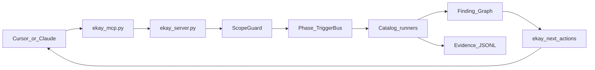
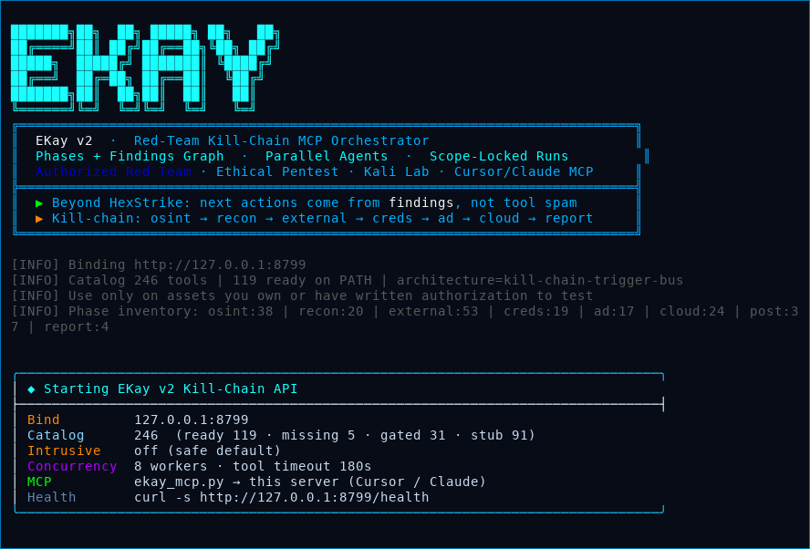

# EKay v2 — Red-Team Kill-Chain Orchestrator

<p align="center">
  
</p>

<p align="center">
  <b>More advanced than HexStrike</b> for authorized red team & ethical pentest<br/>
  Kill-chain phases · Finding graph · Parallel agents · MCP for Cursor / Claude
</p>

<p align="center">
  <a href="docs/TOOLS.md"><strong>Full tool catalog (246)</strong></a> ·
  <a href="docs/catalog.json">catalog.json</a> ·
  <a href="#quick-start-mcp--cursorclaude">Quick start</a>
</p>

> Use only on assets you own or have **written permission** to test.

---

## What is EKay?

**EKay** is a local **cybersecurity orchestration server** that wraps Kali/security binaries and exposes them to AI assistants (Cursor, Claude) over **MCP**, while running a **red-team kill-chain** internally.

| Layer | Role |
| --- | --- |
| `ekay_server.py` | HTTP API + TriggerBus agents + findings |
| `ekay_mcp.py` | MCP stdio bridge for Cursor / Claude |
| Catalog | 246 named tools (nmap, nuclei, certipy, …) |
| ScopeGuard | Blocks out-of-scope targets before any binary runs |
| Evidence | Append-only JSONL for demos / thesis artefacts |

### HexStrike vs EKay

| Topic | HexStrike | **EKay v2** |
| --- | --- | --- |
| Mental model | Flat tool dump | **Kill-chain phases** |
| Memory | Chat only | **Finding graph** |
| “What next?” | LLM guesses | **`ekay_next_actions`** |
| Concurrency | Mostly sequential LLM calls | **TriggerBus** parallel agents |
| Scope | Easy to leave scope | **ScopeGuard** on every run |
| Dangerous tools | Same path as nmap | Risk classes + `EKAY_ALLOW_INTRUSIVE` |
| Red-team depth | Generic scanners | **AD / post / cloud** modules (Certipy, coerce, linpeas, …) |
| Reporting | Ad-hoc paste | Evidence + MITRE tags on findings |



---

## Kill-chain phases

| Phase | Purpose | Example tools |
| --- | --- | --- |
| `osint` | Passive / open-source intel | subfinder, amass, theHarvester |
| `recon` | Host & port discovery | nmap, naabu, rustscan |
| `external` | Web/API attack surface | httpx, nuclei, katana, nikto |
| `initial_access` | Gated foothold sims | SE/phishing-sim (restricted) |
| `creds` | Credential access (gated) | hydra, netexec, john |
| `ad` | Active Directory | certipy, bloodhound-python, ldapdomaindump |
| `cloud` | Cloud posture | prowler, trivy, enumerate-iam |
| `post` | Host triage | linpeas, winpeas, pspy |
| `report` | Evidence packaging | faraday-cli, defectdojo |

**MVP auto-run on `ekay_start_engagement`:**  
`osint` (optional) → `recon` (nmap) → `external` (httpx + nuclei on web ports) → `report` on finalize.

AD / creds / post phases require `EKAY_ALLOW_INTRUSIVE=1` and written authorization.

See the full inventory: **[docs/TOOLS.md](docs/TOOLS.md)**.

---

## Quick start (MCP + Cursor/Claude)

```bash
git clone https://github.com/rohm8358/ekay.git
cd ekay

python3 -m venv ekay-env
source ekay-env/bin/activate
pip install -r requirements.txt

# optional: install as many Kali binaries as possible
sudo ./scripts/install_kali.sh

# Terminal 1 — real server (shows the banner)
./start-ekay.sh
# or: ./ekay-env/bin/ekay-python ekay_server.py
```

Health check (Terminal 2):

```bash
curl -s http://127.0.0.1:8787/health | jq .
./ekay-env/bin/ekay-python -m ekay doctor
./ekay-env/bin/ekay-python -m ekay engage 127.0.0.1 --osint
```

### Cursor / Claude MCP (`~/.cursor/mcp.json`)

```json
{
  "mcpServers": {
    "ekay": {
      "command": "/absolute/path/to/ekay/ekay-env/bin/ekay-python",
      "args": [
        "/absolute/path/to/ekay/ekay_mcp.py",
        "--server",
        "http://127.0.0.1:8787"
      ],
      "timeout": 300
    }
  }
}
```

Keep `ekay_server.py` running. Restart the MCP connection after config changes.

### Recommended chat workflow

1. `ekay_health` / `ekay_doctor`  
2. `ekay_start_engagement` (in-scope target)  
3. `ekay_findings` → `ekay_next_actions`  
4. `ekay_run_tool` / catalog tools for suggested steps  
5. `ekay_advance_phase` (e.g. `ad`) when authorized  
6. `ekay_finalize` → evidence / report summary  

### Meta MCP tools

| Tool | Role |
| --- | --- |
| `ekay_start_engagement` | Start scoped kill-chain run |
| `ekay_findings` | Structured findings |
| `ekay_next_actions` | Suggest next tools from findings |
| `ekay_advance_phase` | Move to ad / creds / cloud / … |
| `ekay_finalize` | Report summary |
| `ekay_phases` | Phase list + tool counts |
| `ekay_list_tools` | Filter catalog by phase/family |
| `ekay_run_tool` | Run one catalog tool |
| `ekay_evidence` | Evidence JSONL |
| `ekay_vs_hexstrike` | Architecture diff |

Plus **every catalog tool** as its own MCP tool (`nmap`, `nuclei`, `certipy`, …).

---

## Tool catalog

| | Count |
| --- | ---: |
| **Total** | **246** |
| HexStrike-origin names | ~130 |
| EKay-only red-team modules | ~116 |

Regenerate docs from source anytime:

```bash
./ekay-env/bin/ekay-python scripts/export_catalog.py
```

- Human-readable: [`docs/TOOLS.md`](docs/TOOLS.md)  
- Machine-readable: [`docs/catalog.json`](docs/catalog.json)  

---

## Demo GIF (real server)

The animation at the top is generated from a **live** `ekay_server.py` process (banner + `/health` + engagement):

```bash
./ekay-env/bin/ekay-python scripts/make_demo_gif.py
# writes assets/ekay-server-demo.gif and assets/ekay-server-banner.png
```

<p align="center">
  
</p>

---

## CLI

```bash
./ekay-env/bin/ekay-python -m ekay doctor
./ekay-env/bin/ekay-python -m ekay phases
./ekay-env/bin/ekay-python -m ekay tools --phase ad
./ekay-env/bin/ekay-python -m ekay engage scanme.nmap.org --osint
./ekay-env/bin/ekay-python -m ekay findings --engagement-id <id>
./ekay-env/bin/ekay-python -m ekay next <id>
./ekay-env/bin/ekay-python -m ekay phase <id> ad
./ekay-env/bin/ekay-python -m ekay finalize <id>
./ekay-env/bin/ekay-python -m ekay compare
```

---

## Configuration

| Variable | Default | Meaning |
| --- | --- | --- |
| `EKAY_HOST` | `127.0.0.1` | Bind address |
| `EKAY_PORT` | `8787` | Bind port |
| `EKAY_SCOPE` | localhost + scanme | Allowed targets (`*` = lab allow-all) |
| `EKAY_ALLOW_INTRUSIVE` | `0` | Unlock intrusive/restricted + AD/creds phases |
| `EKAY_MAX_CONCURRENCY` | `8` | Agent thread pool |
| `EKAY_TOOL_TIMEOUT` | `180` | Seconds per binary |
| `EKAY_MCP_CATALOG_TOOLS` | `1` | Register all catalog tools on MCP |
| `EKAY_TOKEN` | empty | Optional Bearer lock |

Copy `.env.example` → `.env` for local defaults (`.env` is gitignored).

---

## Honest limits

- Cursor/Claude **product security alerts** cannot be removed by EKay. Prefer recon / OSINT / external / report from chat; use gated phases with explicit authorization.  
- Missing binaries return `blocked_reason` — install with `scripts/install_kali.sh`.  
- EKay does **not** ship a raw shell API (`/api/command`).

---

## Tests

```bash
./ekay-env/bin/ekay-python -m pytest -q
```

---

## Disclaimer

EKay wraps **local** security programs for **authorized** assessments. Social-engineering, wireless, relay, and credential modules are for approved lab / contracted work only.
