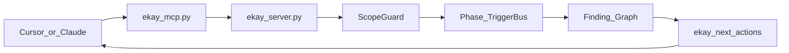

# EKay v2 — Red-Team Kill-Chain Orchestrator

### More advanced than HexStrike for **authorized** red team / ethical pentest

HexStrike = flat MCP tool dump + LLM picks tools.  
**EKay** = **kill-chain phases + finding graph + concurrent agents**, still MCP-connected to Cursor / Claude.

> Use only on assets you own or have **written permission** to test.



---

## Kill-chain phases

| Phase | Purpose |
| --- | --- |
| `osint` | Passive / subdomain intel |
| `recon` | Host & port discovery |
| `external` | Web/API surface + nuclei |
| `initial_access` | Gated foothold sims |
| `creds` | Gated credential testing |
| `ad` | AD enum / BloodHound / Certipy |
| `cloud` | Cloud posture |
| `post` | Host triage (linpeas/…) |
| `report` | Evidence summary |

**MVP auto-run:** `osint` (optional) → `recon` → `external` → `report`.  
AD/creds phases need `EKAY_ALLOW_INTRUSIVE=1` + written auth.

---

## Quick start (MCP + Cursor/Claude)

```bash
cd /home/kali/ekay
python3 -m venv ekay-env
source ekay-env/bin/activate
pip install -r requirements.txt
sudo ./scripts/install_kali.sh   # optional tool install

# Terminal 1
python3 ekay_server.py
# or: ./start-ekay.sh
```

Health:

```bash
curl -s http://127.0.0.1:8787/health | jq .
python3 -m ekay doctor
```

### Cursor / Claude MCP (`~/.cursor/mcp.json`)

```json
{
  "mcpServers": {
    "ekay": {
      "command": "/home/kali/ekay/ekay-env/bin/python3",
      "args": [
        "/home/kali/ekay/ekay_mcp.py",
        "--server",
        "http://127.0.0.1:8787"
      ],
      "timeout": 300
    }
  }
}
```

Keep the server running. Restart Cursor MCP after config changes.

### Meta MCP tools (kill-chain)

| Tool | Role |
| --- | --- |
| `ekay_start_engagement` | Start scoped kill-chain run |
| `ekay_findings` | Structured findings |
| `ekay_next_actions` | Suggest next tools from findings |
| `ekay_advance_phase` | Move to ad/creds/cloud/… |
| `ekay_finalize` | Report summary |
| `ekay_run_tool` / catalog tools | Direct binary runs |
| `ekay_vs_hexstrike` | Diff summary |

Plus **full catalog** tools (nmap, nuclei, certipy, …) like HexStrike.

---

## CLI

```bash
python3 -m ekay doctor
python3 -m ekay phases          # needs server
python3 -m ekay engage scanme.nmap.org --osint
python3 -m ekay findings --engagement-id <id>
python3 -m ekay next <id>
python3 -m ekay phase <id> ad
python3 -m ekay finalize <id>
python3 -m ekay tools --phase ad --only-ready
```

---

## Why this beats HexStrike

| Topic | HexStrike | EKay v2 |
| --- | --- | --- |
| Control | LLM sequential tool spam | **Phase TriggerBus** |
| Memory | Chat context only | **Finding graph** |
| Next step | Guess | **`ekay_next_actions`** |
| Scope | Easy to leave scope | **ScopeGuard** every run |
| Dangerous tools | Same path as nmap | Risk + intrusive gate |
| Red-team depth | Generic dump | **AD/post modules** (Certipy, coerce, linpeas, …) |
| Reporting | Ad-hoc | Evidence + MITRE tags |

### Honest limit

Cursor/Claude **product security alerts** cannot be removed by EKay. Design assumes:

- Chat agents drive **recon / OSINT / external / report** cleanly  
- High-impact phases need explicit `ekay_advance_phase` + `EKAY_ALLOW_INTRUSIVE=1`  
- Always have written authorization

---

## Configuration

| Variable | Default | Meaning |
| --- | --- | --- |
| `EKAY_HOST` | `127.0.0.1` | Bind |
| `EKAY_PORT` | `8787` | Port |
| `EKAY_SCOPE` | localhost + scanme | Allowed targets (`*` = lab allow-all) |
| `EKAY_ALLOW_INTRUSIVE` | `0` | Unlock intrusive/restricted + AD phases |
| `EKAY_MAX_CONCURRENCY` | `8` | Agent pool |
| `EKAY_TOOL_TIMEOUT` | `180` | Seconds per binary |
| `EKAY_MCP_CATALOG_TOOLS` | `1` | Register all catalog MCP tools |

---

## Tests

```bash
pip install -r requirements.txt
python3 -m pytest -q
```

---

## Disclaimer

EKay wraps **local** security programs for **authorized** assessments. Social-engineering, wireless, relay, and credential modules are for approved lab / contracted work only.
